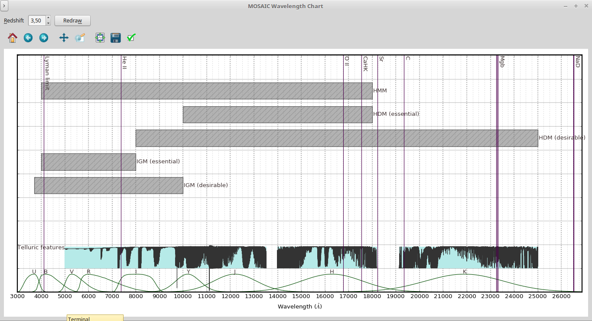

# aosss

Adaptive Optics Systems Simulation Support 

Welcome!


# Introduction

`ftaosss` is a Python package and set of applications to facilitate 
steps in spectrograph+telescope simulation workflows: 

  - assemble a data cube for IFU simulation
  - batch-download simulations resulting files
  - organize resulting files
  - generate visual reports
  - compile results into *spectrum list files*
  - process/convert/visualize these *spectrum list files* 
  
## Structure

`ftaosss` contains an API (application programming interface) and a set of scripts (standalone programs)
that use this API.

### `aosss` Applications

Graphical applications:
  - `wavelength-chart.py` -- Draws a [wavelength] x [various stacked information] chart

Command-line tools:
  - `create-spectrum-lists.py` -- Create several .splist files, grouping spectra by their wavelength vector
  - `ftaosss-create-websim-report.py` -- Creates report for a given set of WEBSIM-COMPASS output files
  - `get-compass.py` -- Downloads a number of Websim-Compass simulations
  - `ftaosss-programs.py` -- Lists all programs available with `ftaosss` package

All the programs above can be called with the `--help` or `-h` option for more documentation

# Quick Start

This sections shows examples on how to perform a variety of tasks using `aosss` applications.

## List `aosss` applications

```shell
programs.py -p aosss
```

## Download simulation results

```shell
aosss-get-compass.py 1206-1213
```

will download results for simulations *C001206*, *C001207*, ..., 
*C001213* **into the local directory**, after which you will see files
`C*.fits`, `C*.par`,  `C*.out`

## Create reports

```shell
aosss-create-simulation-reports.py 1206-1213
```

creates **HTML** and **PNG** files, for instance:

```shell
$ ls report-C001206*
report-C001206-000.png  report-C001206-002.png  report-C001206-004.png  report-C001206-006.png  report-C001206-008.png  report-C001206.html
report-C001206-001.png  report-C001206-003.png  report-C001206-005.png  report-C001206-007.png  report-C001206-009.png
```

## Group resulting spectra with same wavelength axis
  
The following will group all files `C*_spintg.fits` into different
**spectrum list files**. Each of these files will contain the spectra that
share the same wavelength axis.

```shell
aosss-create-spectrum-lists.py
```

## Organize files

The following will move files into different directories according to
some rules:

```shell
$ aosss-organize-directory.py --help
usage: aosss-organize-directory.py [-h]

Performs a list of pre-defined tasks to organize a directory containing simulations:
  - moves 'root/report-*'       to 'root/reports'
  - moves 'root/C*'             to 'root/raw'
  - moves 'root/raw/simgroup*'  to 'root/'
  - moves 'root/raw/report-*'   to 'root/reports'
  - [re]creates 'root/reports/index.html'

This script can be run from one of these directories:
  - 'root' -- a directory containing at least one of these directories: 'reports', 'raw'
  - 'root/raw'
  - 'root/reports'

The script will use some rules to try to figure out where it is running from

optional arguments:
  -h, --help  show this help message and exit

$ aosss-organize-directory.py
. 
.
.
[INFO    ]   - Move 221 objects
[INFO    ]   - Create 'reports/index.html'
Continue (Y/n)? 

```

## Browse through reports

```shell
cd reports
xdg-open index.html
```

will open file `index.html` in browser

[](img/index-html.png)

## Inspecting where spectral lines of interest will fall due to redshift

```shell
aosss-wavelength-chart.py
```

Lines with zero redshift:


Lines with `z=3.5`:


# API reference