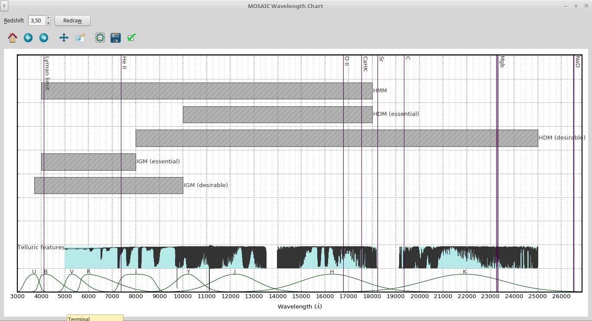
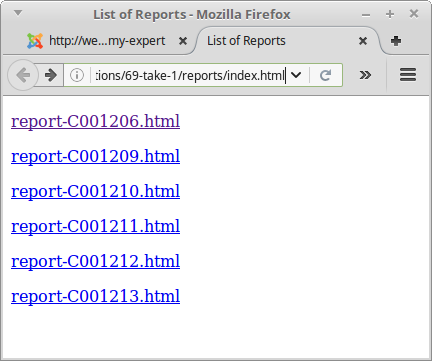
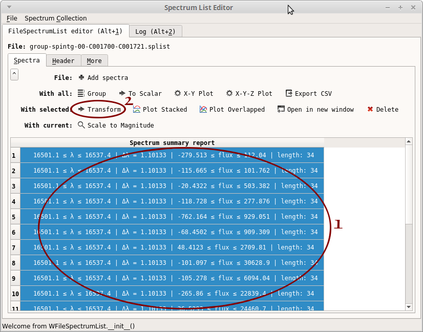
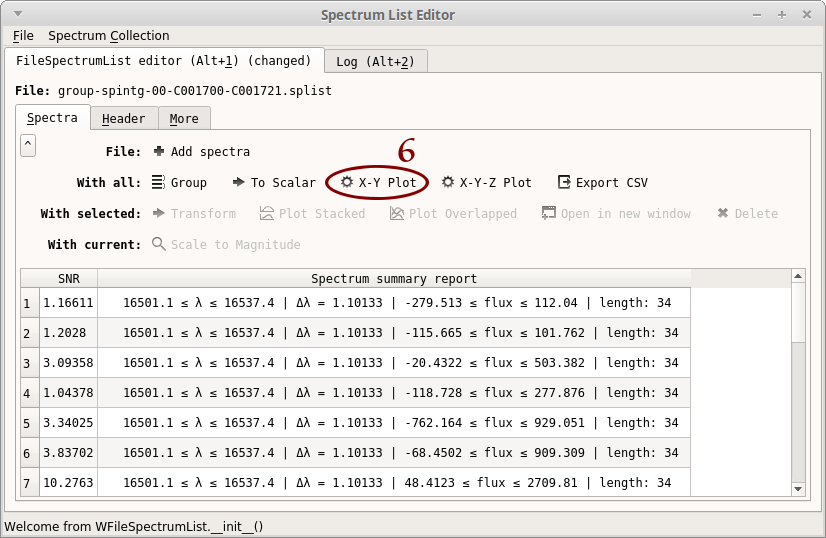

*f311.aosss*: Adaptive Optics Systems Simulation Support
========================================================

The *aosss* package helps to automatize the simulation of Adaptive Optics Systems.

Quick Start
-----------

List *aosss* applications
~~~~~~~~~~~~~~~~~~~~~~~~~

.. code:: shell

    programs.py -p aosss

    Graphical applications
    ----------------------

      wavelength-chart.py ......... Draws chart showing spectral lines of interest,
                                    spectrograph wavelength ranges, ESO atmospheric
                                    model, etc.

    Command-line tools
    ------------------

      create-simulation-reports.py  Creates HTML reports from WebSim-COMPASS output
                                    files
      create-spectrum-lists.py .... Create several .splist (spectrum list) files
                                    from WebSim-COMPASS output files; groups spectra
                                    that share same wavelength vector
      get-compass.py .............. Downloads WebSim-COMPASS simulations
      list-mosaic-modes.py ........ Lists MOSAIC Spectrograph modes
      organize-directory.py ....... Organizes simulation directory (creates folders,
                                    moves files, creates 'index.html')

**Note** All the programs above can be called with the ``--help`` or ``-h``
option for more information

Find wavelength region for simulation
~~~~~~~~~~~~~~~~~~~~~~~~~~~~~~~~~~~~~

.. code:: shell

    wavelength-chart.py

|image1|

**Figure** -- Lines with zero redshift

This application creates a chart stacking the MOSAIC spectrograph wavelength coverages and
an ESO Earth atmospheric model. This may serve either as a reference to MOSAIC wavelength invervals for each
mode (on this, see also ``list-mosaic-modes.py``) or to verify the Earth atmospheric emission/trasmission
in a wavelength region of observational interest.

It is also possible to inform a redshift so that the chemical lines will be accordingly displaced:

|image2|

**Figure** -- ``z=3.5``

.. |image1| image:: img/chart-z-0.png

Download simulation results
~~~~~~~~~~~~~~~~~~~~~~~~~~~

The following example assumes that simulations coded from 1700 to 1721 already finished on the
WebSim-COMPASS server.

``get-compass.py`` is a Python script based on ``get-compass.sh`` which can be downloaded from the
WebSim-COMPASS webpage. The former enhances the latter in which:

- It can download several simulations in a single command

- It is possible to specify the "stage" of the simulation pipeline to download results from. For example,
  it is possible to download only the "spintg" file, skipping the large data cubes from intermediary stages.

.. code:: shell

    get-compass.py 1700-1721 --stage spintg

will download results for simulations *C001700*, *C001701*, ...,
*C001721* **into the local directory**, after which you will see files
``C*.fits``, ``C*.par``, ``C*.out``

Organize simulation results
~~~~~~~~~~~~~~~~~~~~~~~~~~~

Group resulting spectra in a single file
^^^^^^^^^^^^^^^^^^^^^^^^^^^^^^^^^^^^^^^^

This step is required for later analysis using ``splisted.py``

The following command will group all files "C*_spintg.fits" into a single ".splist" (Spectrum List) file,
which can later be opened using ``splisted.py``

.. code:: shell

    $ create-spectrum-lists.py
    .
    .
    .
    [INFO    ] Created file './group-spintg-00-C001700-C001721.splist'
    [INFO    ] Created file './group-spintg-01-C001712-C001712.splist'

Create reports (optional)
^^^^^^^^^^^^^^^^^^^^^^^^^

This step creates HTML pages (one for each simulation) that help to navigate through the simulation
results.

.. code:: shell

    create-simulation-reports.py 1700-1721

Organize the directory
^^^^^^^^^^^^^^^^^^^^^^

At this point, the current directory has a large number of files (".fits", ".html", ".png", etc.),
whereas for our analysis, only the ".splist" file is required.

``organize-directory.py`` will:

- create a directory named "raw" where it will copy ".fits", ".par" and ".out" files

- create a directory named "reports" where it will copy ".html" and ".png" files. In addition, it will
  create a file "index.html" that will serve as an index for the ".html" files

.. code:: shell

    organize-directory.py
    . 
    .
    .
    [INFO    ]   - Move 108 objects
    [INFO    ]   - Create 'reports/index.html'
    Continue (Y/n)? 

Browse through reports
~~~~~~~~~~~~~~~~~~~~~~

.. code:: shell

    cd reports
    xdg-open index.html

will open file "index.html" in browser

|image0|

**Figure** -- Reports index

Edit Spectrum List file
~~~~~~~~~~~~~~~~~~~~~~~

If you types the commands above to visualize reports, you will need to go back one directory level:

.. code:: shell

    cd ..

Now open the Spectrum List Editor (part of the f311 package):

.. code:: shell

    splisted.py group-spintg-00-C001700-C001721.splist

In the following steps, we will:

- Plot the spectra

- Calculate the Signal-to-noise ratio (SNR)

- Plot the Detector Integration Time (DIT) *vs* the SNR

1. Select all the spectra: click inside the table, then press **Ctrl+A**

|imaget0|

2. Click on "Plot Overlapped". A plot window opens. From this plot, we can see that the region
   16508-16534 seems to be free of atmospheric contamination. You may close the plot window

|imaget1|

3. Click on "To Scalar". Another window opens

4. Type "ToScalar_SNR(16508, 16534)"

5. Click on "OK"

|imaget2|

6. Notice that a new column "SNR" appear in the table. Click on "X-Y Plot"

|imaget3|

7. Select "Error bars"

8. Select "OBS_DIT"

9. Click on "Redraw"

|imaget4|

.. |imaget1| image:: img/splisted-tut-1.png
.. |imaget2| image:: img/splisted-tut-2.png

.. |imaget4| image:: img/splisted-tut-4.png

API reference
-------------

:doc:`autodoc/f311.aosss`
