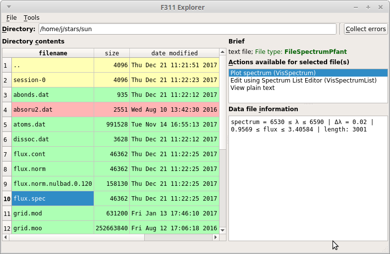

F311 -- collaborative model for Python programmers in Astronomy
===============================================================

Welcome!

Most of the programming work is related to loading, saving, visualizing, and manipulating data
files somehow. Project F311 provides a common ground to create new Python packages containing new
file handling and visualization routines, allowing these file types to be accessed through the
``explorer.py`` (:numref:`figexplorer`) application in a plugin-like fashion. Your new Python packages may also contain
scripts that will be found and listed by ``programs.py``.

The project alone can handle a few types of 1D spectral files (such as FITS, "x-y").

By the end of 2017, the following projects were listed as *collaborators*:

- ariastro (https://github.com/aricorte/ariastro)
- PyFANT (https://github.com/trevisanj/pyfant)
- aosss (https://github.com/trevisanj/aosss)

Quick install
-------------

.. code:: shell

    pip install f311

Or visit the :doc:`installation page <install>`_.

Importing the API
-----------------

F311 provides an API that can be imported like this::

    import f311

Applications (scripts)
----------------------

The following applications are included in package ``f311``:

* :doc:`explorer.py <autoscripts/script-explorer>`: F311 Explorer -- file manager-like GUI (graphical user interface)
* :doc:`programs.py <autoscripts/script-programs>`: Lists all programs available across all *collaborators packages*
* :doc:`cut-spectrum.py <autoscripts/script-cut-spectrum>`: Cuts spectrum file to wavelength interval specified
* :doc:`plot-spectra.py <autoscripts/script-plot-spectra>`: Plots spectra on screen or creates PDF file

.. _figexplorer:

    -- ``explorer.py`` screenshot.

Acknowledgement
---------------

The project started in 2015 at IAG-USP (Institute of Astronomy, Geophysics and Atmospheric Sciences
at University of São Paulo, Brazil).

Partially funded by FAPESP - Research Support Foundation of the State of São Paulo, Brazil (2015-2017).

Contents
========

.. toctree::
   :maxdepth: 1

   install
   scripts
   api
   examples

.. only:: html

    API Reference
    -------------

    * :ref:`genindex` (all symbols listed alphabetically)
    * :ref:`modindex` (whole f311 package tree)

    .. hint:: You can also search using the sidebar box.

